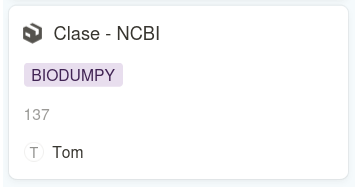

[](https://www.python.org/) [](https://github.com/Naereen/badges/)

# Manual de buenas prácticas para la realización de cambios en el repositorio :books:

## 1. Preparación local :arrow_down:

**Clonar el repositorio**: Si aún no tienes una copia local del proyecto, clona el repositorio desde GitHub:
```
git clone https://github.com/centrebalearbiodiversitat/cbbdb.git
```

**Crear una nueva rama**:  Antes de realizar cambios, crea una nueva rama basada en la rama principal de desarrollo ("dev") para aislar tus modificaciones:
```
git checkout -b PROYECTO-ID
```

Reemplaza "PROYECTO-ID" por código del ticket de Notion  en el que estás trabajando[^1]. Para ello deberás utilizar el nombre del proyecto al que pertenece el ticket seguido de su ID. Por ejemplo:



En este caso, deberías de llamar a tu rama "BIODUMPY-137".

>Nota :eyes:
> 
>Ten en cuenta que la numeración del ID de cada ticket no es consecutiva en relación a su proyecto, es decir, siguiendo el ejemplo anterior, "BIODUMPY-137" no significa que sea el ticket número 137 que se ha creado para el proyecto BIODUMPY, si no que del total de tickets creados para todos los proyectos, al momento de crear dicho ticket para ese proyecto se generó el ID nº137.


## 2. Realizar los cambios 🥚🐣🐥🐓

Editar los archivos: Realiza los cambios necesarios en los archivos de tu proyecto según las especificaciones del ticket en Notion[^1]


## 3. Commit de los Cambios :memo:

**Añadir los archivos**: Agrega los archivos modificados al índice de Git:
```
git add .
```

**Realizar el commit**: Crea un commit con un mensaje claro y conciso que describa los cambios realizados:
```
git commit -m "feat(geography): Implementation of Balearic municipalities"
```


>Nota :eyes:
>
>Sigue la guía de buenas praćticas en los commits para su redacción :arrow_down:

### Buenas Prácticas en los Commits 🧘‍♀️

Para mantener un historial de Git claro y conciso, es recomendable adoptar convenciones en los mensajes de commit. Una práctica común es utilizar convenciones SemVer (Semantic Versioning), que permiten clasificar los cambios de forma clara y automática.

Estructura básica de un mensaje de commit:

**<font color="BF4458">tipo</font> <font color="05ADBA">(scope)</font>: <font color="/BB926">mensaje corto</font>**


**<font color="BF4458">tipo</font>** -> Indica el tipo de cambio que se ha realizado. Debe ser uno de los siguientes:
- **<font color="BF4458">feat</font>**: Nueva funcionalidad
- **<font color="BF4458">fix</font>**:Corrección de errores
- **<font color="BF4458">refactor</font>**: Refactorización de código (sin cambios en la funcionalidad)
- **<font color="BF4458">test</font>**: Nuevos tests o cambios en los tests existentes
- **<font color="BF4458">docs</font>:** Cambios en la documentación
 
**<font color="05ADBA">scope</font>** -> (opcional) Un ámbito más específico del cambio (ej: api, database, utils).

**<font color="7BB926">mensaje corto</font>** -> Una descripción concisa del cambio.


Ejemplos:
```
feat(taxonomy view): Add the TaxonomyListView endpoint

fix(database): Correct a query error in the occurrences database

docs(readme): Update data loading instructions in genetics
```


## 4. Push a la Rama Remota :arrow_up:

**Enviar los cambios a GitHub**:
```
git push origin PROYECTO-ID
```

## 5. Crear un Pull Request :shipit:

- **Ir a GitHub**: Accede a tu repositorio en GitHub.
- **Crear un Pull Request**: Busca la nueva rama que acabas de crear y haz clic en el botón para crear un pull request.
- **Describir el Pull Request**: Proporciona una descripción clara y concisa de los cambios realizados, vincula el ticket de Notion[^1] y asigna a los revisores necesarios.

## Mejores Prácticas :nerd_face:

- **Una rama por ticket**: Crea una rama para cada ticket a resolver.
- **Commits atómicos**: Cada commit debe representar un cambio lógico y completo.
- **Mensajes de commit claros**: Los mensajes de commit deben ser concisos y describir el propósito del cambio.
- **Revisiones por pares**: Siempre solicita una revisión por pares antes de fusionar los cambios.
- **Mantener el tablero de Notion actualizado**[^1]: Una vez que se fusiona un pull request, actualiza el estado del ticket correspondiente en Notion.


[^1]: Dicha acción solo puede llevarla un miembro del [**<font color="BF4458">C</font><font color="05ADBA">B</font><font color="7BB926">B</font>**](https://centrebaleardebiodiversitat.uib.es/) o persona que haya sido invitada como Colaborador al repositorio. En caso de no cumplir ninguna de estas dos condiciones, no es necesario que sigas dicha norma, pero si que mantengas el resto de buenas prácticas descritas en el manual :pray:.