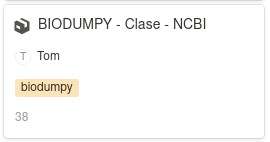

[](https://www.python.org/) [](https://github.com/Naereen/badges/)


# Best practices manual for making changes to the repository :books:

## 1. Local Preparation :arrow_down:

**Clone the repository**: If you don't yet have a local copy of the project, clone the repository from GitHub:
```
git clone https://github.com/centrebalearbiodiversitat/cbbdb.git
```

**Create a new branch**: Before making any changes, create a new branch based on the main development branch ("dev") to isolate your modifications:
```
git checkout -b PROJECT-ID
```

Replace "PROJECT-ID" with the code of the Notion ticket you are working on. To do this, you should use the name of the project to which the ticket belongs, followed by its ID. For example:



In this case, you should name your branch "BIODUMPY-38."

>[!NOTE]
>Please note that the ID numbering of each ticket is not consecutive in relation to its project. In other words, following the previous example, "BIODUMPY-38" does not mean it is the 38th ticket created for the BIODUMPY project, but rather that out of all the tickets created for all projects, the ID number 38 was generated when creating that ticket for this project.


## 2. Make the Changes 🥚🐣🐥🐓

**Edit the files**: Make the necessary changes to your project files according to the specifications in the Notion ticket[^1].


## 3. Commit the Changes :memo:

Add the files: Add the modified files to the Git index:
```
git add .
```

**Create the commit**: Create a commit with a clear and concise message describing the changes made:
```
git commit -m "feat(geography): Implementation of Balearic municipalities"
```

>[!IMPORTANT]
>
>Follow the best practices guide for writing commits :arrow_down:

### Best Practices for Commits 🧘‍♀️

To maintain a clear and concise Git history, it's recommended to adopt conventions for commit messages. A common practice is to use SemVer conventions (Semantic Versioning), which allow for a clear and automatic classification of changes.

Basic structure of a commit message:

**<font color="BF4458">type</font> <font color="05ADBA">(scope)</font>: <font color="7BB926">short message</font>**

**<font color="BF4458">type</font>** -> Indicates the type of change made. Some common types are:

- **<font color="BF4458">feat</font>**: New functionality
- **<font color="BF4458">fix</font>**: Bug fix
- **<font color="BF4458">docs</font>**: Documentation changes
- **<font color="BF4458">style</font>**: Styling changes (spacing, formatting, etc.)
- **<font color="BF4458">refactor</font>**: Code refactoring (no changes in functionality)
- **<font color="BF4458">test</font>**: New tests or changes to existing tests
- **<font color="BF4458">chore</font>**: Maintenance tasks (build, configuration, etc.)

**<font color="05ADBA">scope</font>** -> (optional) A more specific scope of the change (e.g. api, database, utils).

**<font color="7BB926">short message</font>** -> A concise description of the change.

Examples:
```
feat(taxonomy view): Add the TaxonomyListView endpoint

fix(database): Correct a query error in the occurrences database

docs(readme): Update data loading instructions in genetics
```


## 4. Push to the Remote Branch :arrow_up:

**Push the changes to GitHub**:
```
git push origin PROJECT-ID
```

## 5. Create a Pull Request :shipit:

**Go to GitHub**: Access your repository on GitHub.

**Create a Pull Request**: Find the new branch you just created and click the button to create a pull request.

**Describe the Pull Request**: Provide a clear and concise description of the changes made, link the Notion ticket[^1], and assign the necessary reviewers.

## Best Practices :nerd_face:

- **One branch per ticket**: Create a branch for each ticket to be resolved.
- **Atomic commits**: Each commit should represent a logical, complete change.
- **Clear commit messages**: Commit messages should be concise and describe the purpose of the change.
- **Peer reviews**: Always request a peer review before merging changes.
- **Keep the Notion board updated**[^1]: Once a pull request is merged, update the status of the corresponding ticket in Notion.


[^1]: This action can only be performed by a member of the [**<font color="BF4458">C</font><font color="05ADBA">B</font><font color="7BB926">B</font>**](https://centrebaleardebiodiversitat.uib.es/) or someone invited as a collaborator to the repository. If you do not meet either of these conditions, there is no need to follow this rule, but you should adhere to the rest of the best practices described in the manual :pray:.